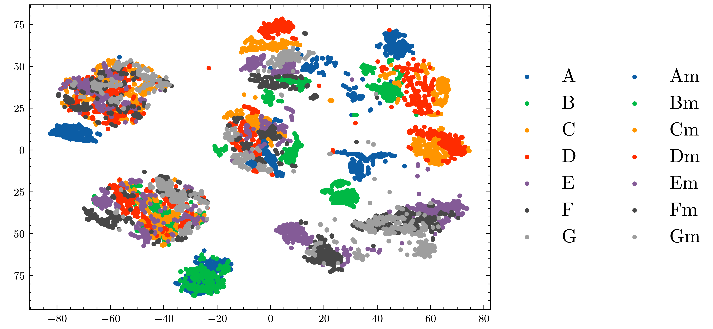
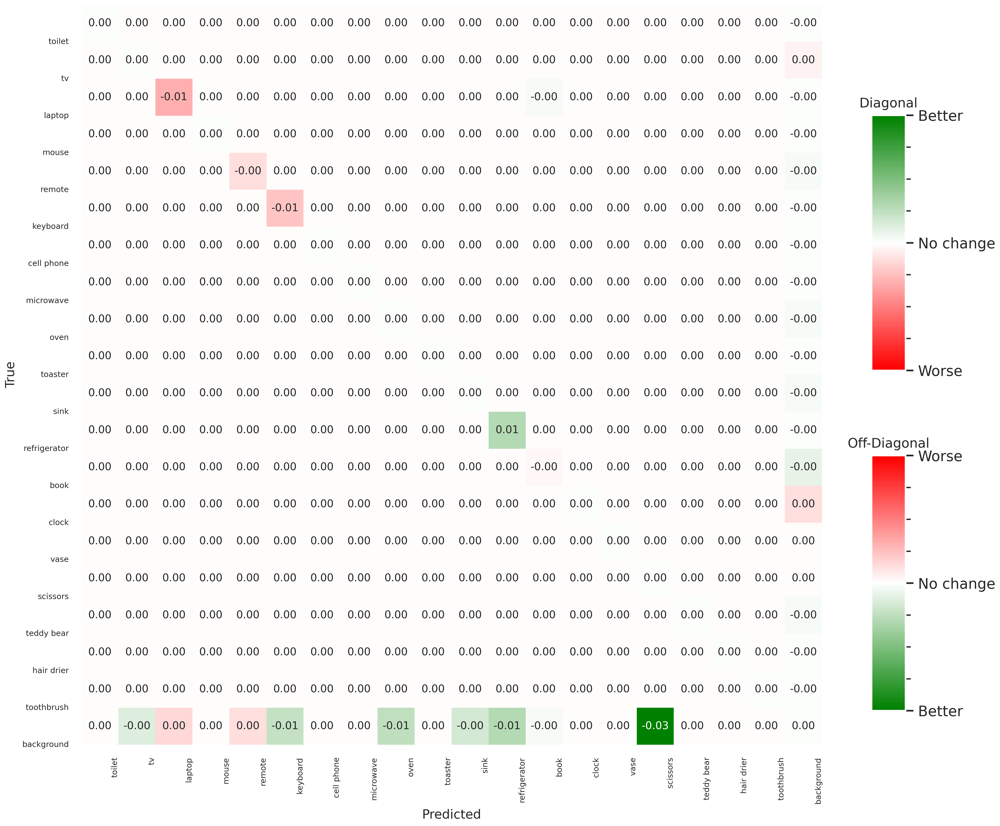
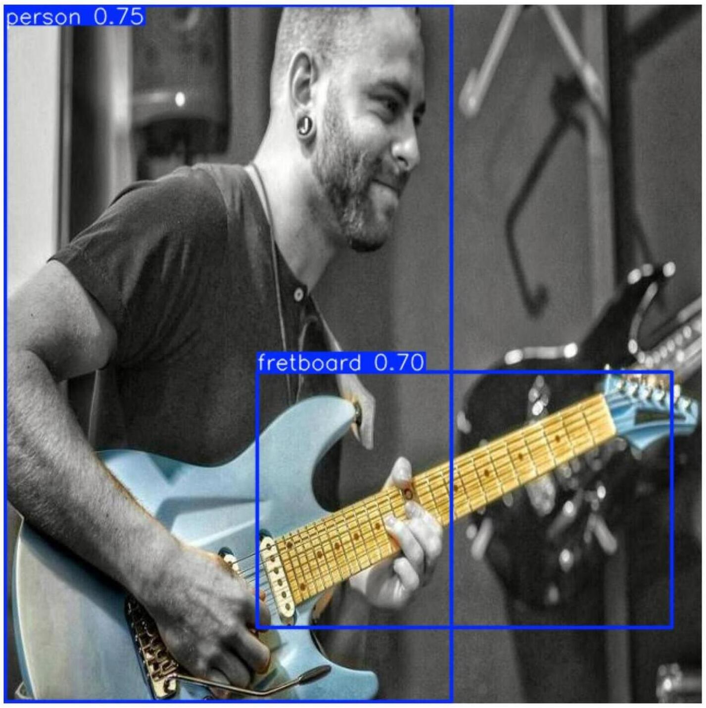

# High-Level Computer Vision (HLCV) 

This repository contains implementations of various assignments and a project related to the [High-Level Computer Vision](https://www.mpi-inf.mpg.de/departments/computer-vision-and-machine-learning/teaching/courses-1/ss-2024-high-level-computer-vision) course lectured by [Prof. Dr. Bernt Schiele](https://www.mpi-inf.mpg.de/departments/computer-vision-and-machine-learning/people/bernt-schiele) at [Saarland University](https://www.uni-saarland.de/) during the Sommer Semester 2024. *All course materials and assignments outlines belong to the course's instructors*.

## Assignments
Each assignment is organized in separate folders as outlined below:

- **Assignment 1**: Exercises and code related to the first assignment.
    - Classical Machine Learning: Image Representations and Histogram Distances (`grayvalue`, `rgb`, `rg`, `dxdy`), Object/Neighbours Identification via distance metrics (`Chi^2`, `L2`), and performance evaluation with `PR` curve.
    - [UCI ML hand-written digits](https://archive.ics.uci.edu/dataset/80/optical+recognition+of+handwritten+digits) recognition with an `SVM` classifier.
- **Assignment 2**: Exercises and code related to the second assignment.
    - Simple two-layer neural network and SGD training algorithm based on back-propagation using only basic matrix operations.
    - Multi-layer perceptron using [PyTorch](https://pytorch.org/) with different layer configurations using `BatchNorm`, `Dropout`, and `EarlyStopping` as regularization techniques. 
    - Both trained, finetuned using `GridSearchCV` and evaluated on the [CIFAR-10](http://www.cs.toronto.edu/~kriz/) dataset.
- **Assignment 3**: Exercises and code related to the third assignment.
    - Convolutional Neural Networks (CNN) using [PyTorch](https://pytorch.org/) for image classification on the [CIFAR-10](http://www.cs.toronto.edu/~kriz/) dataset, with filters visualization, `Top-1` and `Top-5` accuracy evaluation.
    - `BatchNorm`, `Dropout`, `Data Augmentation` and `EarlyStopping` as regularization techniques to improve the model's generalization.
    - Fine-tune the pre-trained model [`VGG_11_bn`](https://pytorch.org/vision/main/models/generated/torchvision.models.vgg11_bn.html) on the [CIFAR-10](http://www.cs.toronto.edu/~kriz/) dataset, with various configurations (fine-tuning only the classifier layers, fine-tuning the entire model with pre-loaded weights, and without pre-loaded weights).

## Project: From Strings to Sequences — Acoustic Guitar Chords Recognition
See the [Project/reports/](Project/reports/) folder for the complete LaTeX report.

**Summary**: This system automates **chord recognition** from acoustic guitar videos by detecting and classifying chords based on video input. It leverages **YOLO** and **Faster R-CNN** for fretboard detection, allowing the system to identify the position of the hand and fingers on the guitar neck. For chord classification, it utilizes **Vision Transformers** and **DINOv2**, which process visual cues to distinguish between different chords. Additionally, **hand pose estimation** was explored as a potential method to perform chord recognition. Finally, We extend the work from [[Kristian et al., 2024]](https://ph01.tci-thaijo.org/index.php/ecticit/article/view/254624) by exploring the potential of using state-of-the-art deep learning models and techniques with an additional proposal for an audio generation module.

### Table of Contents
- [High-Level Computer Vision (HLCV)](#high-level-computer-vision-hlcv)
  - [Assignments](#assignments)
  - [Project: From Strings to Sequences — Acoustic Guitar Chords Recognition](#project-from-strings-to-sequences--acoustic-guitar-chords-recognition)
    - [Table of Contents](#table-of-contents)
    - [Introduction](#introduction)
    - [Datasets](#datasets)
    - [Methods](#methods)
      - [Fretboard Detection](#fretboard-detection)
      - [Guitar Chord Classification](#guitar-chord-classification)
        - [Hand Pose Estimation + Classifier](#hand-pose-estimation--classifier)
        - [Classifier only approach](#classifier-only-approach)
    - [Experimental Results and Analyses](#experimental-results-and-analyses)
      - [Fretboard Detection](#fretboard-detection-1)
      - [Guitar Chord Classification](#guitar-chord-classification-1)
        - [Hand Pose Estimation + Classifier](#hand-pose-estimation--classifier-1)
        - [Classifier only approach](#classifier-only-approach-1)
    - [Conclusion](#conclusion)

### Introduction
ACR is an information retrieval task that automatically recognizes the chords played in a music piece, whether it be an audio or video file. The ability to accurately recognize and identify chords is crucial for various downstream applications such as music analysis, music transcription, or even restoration of corrupted musical performances.

Our work aims to improve ACR in the context of acoustic guitars. We base our work on [[Kristian et al., 2024]](https://ph01.tci-thaijo.org/index.php/ecticit/article/view/254624) and extend it by exploring the YOLO [[Redmon et al., 2016]](https://arxiv.org/abs/1506.02640) and Faster R-CNN [[Ren et al., 2016]](https://arxiv.org/abs/1506.01497) family for *fretboard* (the neck of the guitar) recognition, alongside ViT [[Dosovitskiy et al., 2020]](https://arxiv.org/abs/2010.11929) and DINOv2 [[Oquab et al.]](https://arxiv.org/abs/2304.07193) architectures for chord recognition.

### Datasets 
We identified a significant gap in available datasets for the task of guitar chord recognition. Initially, we created our own by recording 90-second videos for each chord in three different environments, ensuring high quality by capturing them in 4K resolution at 60 fps. We extracted the frames from the video and downsampled them to a resolution of 640 $\times$ 360 pixels. This process generated approximately 30,000 frames per chord. To increase the diversity of the dataset, we used two different sampling methods: simple random sampling and kNN-based sampling. In the former method, we selected 1,000 frames at random, while in the latter, we used the kNN to choose 1,000 frames that were the most distinct from one another.

<figure id="tsne-plot">
  
  <figcaption><strong>Figure 1:</strong> The t-SNE plot of our dataset containing 14 chords. Each point represents a KNN-sampled frame, with the color indicating the corresponding chord label.</figcaption>
</figure>

 

Unfortunately, both sampling strategies resulted in an overly simplistic dataset that failed to capture the real-world complexity of chords, as shown by the above [Figure](#tsne-plot). This resulted in poor model generalization. However, rather than abandoning our dataset we used it as a test set to evaluate the generalizability of our model. In the end, we decided to use existing datasets [[1](https://universe.roboflow.com/grc-mask-custom-dataset/guitar-chord-bounding-box), [2](https://universe.roboflow.com/grc-mask-custom-dataset/guitar-chord-handshape), [3](https://universe.roboflow.com/joaomarcoscrs/guitar-chords-daewp), [4](https://universe.roboflow.com/my-work-3idwy/guitar-chord-tvon8)] publicly available in [Roboflow](https://universe.roboflow.com/) for training the models, merging them to create a more complex dataset which resulted in significantly better results.

This change in our approach necessitated a change in the scope of our chord recognition task. As a consequence of using existing datasets, we were limited to only seven chords in total—A, B, C, D, E, F, and G—down from the 14 chords originally planned.

For the fretboard detection task, we used pre-trained versions of the models on the [COCO dataset](https://cocodataset.org/#home), which is of considerable size commonly dedicated to object identification, where pproximately 200,000 labeled images are organized into 80 distinct categories [[Lin. et al]](https://arxiv.org/abs/1405.0312) (somewhat comparable to [ImageNet](https://www.image-net.org/), but with a different emphasis with regards to types of objects). This is further explained in [Methods](#methods). To finetune it, we used the following publicly available dataset in [Roboflow](https://universe.roboflow.com/) by Hubert Drapeau: [Guitar necks detector](https://universe.roboflow.com/hubert-drapeau-qt6ae/guitar-necks-detector/dataset/1).

### [Methods](#methods) 

#### Fretboard Detection
We experimented with the [YOLOv8](https://github.com/autogyro/yolo-V8) (m), [YOLOv9](https://github.com/WongKinYiu/yolov9) (c) and [YOLOv10](https://github.com/THU-MIG/yolov10) (l) models[^1], and from the Faster R-CNN family [[Ren et al., 2016]](https://arxiv.org/abs/1506.01497), we tried a [ResNet-50-FPN backbone](https://pytorch.org/vision/master/models/generated/torchvision.models.detection.fasterrcnn_resnet50_fpn.html#torchvision.models.detection.FasterRCNN_ResNet50_FPN_Weights) and a [MobileNetV3-Large FPN backbone](https://pytorch.org/vision/master/models/generated/torchvision.models.detection.fasterrcnn_mobilenet_v3_large_fpn.html#torchvision.models.detection.fasterrcnn_mobilenet_v3_large_fpn)[^2]. Furthermore, we tried two different finetuning methods: freezing every layer and adding a classifier head for our new <em>fretboard class</em> whose output is concatenated with the existing final layer output (from now on, models with "(FB)" next to the name), and not freezing any layer, i.e., finetuning the whole model. Both methods are fundamentally different and serve different purposes. The first method is used to finetune the model to a specific task while keeping the backbone as it is. This allows us to keep the previous learned features and classes. On the other hand, the second method will finetune the
whole model to the new task, while potentially forgetting the previous learned features and classes. In our finetuning process, this one had the effect of having only 2 classes in the end: the <em>fretboard class</em> and the background.

[^1]: For a similar parameter count, we chose these model sizes which are different for each version; m: `25.9M`, c: `25.3M`, l: `24.4M`.

[^2]: For easily finetuning the Faster R-CNN models, we used the [Faster R-CNN Pytorch Training Pipeline](https://github.com/sovit-123/fasterrcnn-pytorch-training-pipeline) by Sovit Ranjan Rath.

#### Guitar Chord Classification
We used two different approaches for guitar chord classification: a [Hand Pose Estimation + Classifier](#hand-pose-estimation--classifier) approach and a [Classifier Only](#classifier-only-approach) approach.

##### Hand Pose Estimation + Classifier
First, we wanted to try a simple yet interesting approach. For a given sample image, we utilized a hand pose estimation model to extract the hand shape from it, which was then used as the input to a classifier. We used [MediaPipe](https://github.com/google-ai-edge/mediapipe/tree/master) to extract the hand shape followed by different classifiers — SVM, Random Forest, and a simple MLP — to classify the chords.

<figure>
  
  <figcaption><strong>Figure 2:</strong> The pipeline of the Hand Pose Estimation + Classifier approach. First, the image is passed through a hand pose estimation model to extract the landmarks. Then the result is passed through a classifier to determine the chord being played.</figcaption>
</figure>

##### Classifier only approach
Next, we wanted to explore the potential benefits of using more advanced architectures to perform chord classification. We decided to experiment with Vision Transformers (ViT) [[Dosovitskiy et al., 2020]](https://arxiv.org/abs/2010.11929), specifically ViT-B/16, ViT-B/32, ViT-L/16, and ViT-L/32, available on [Hugging Face](https://huggingface.co/google/vit-base-patch16-224-in21k) to assess how different configurations of patch sizes and model sizes would impact performance. Additionally, we were also interested in evaluating the effectiveness of pre-trained self-supervised models in our task, so we also included DINOv2 [[Oquab et al.]](https://arxiv.org/abs/2304.07193) in our experiments. This allowed us to compare their performance against the ViT models and explore whether self-supervised learning offers advantages in this task.

### Experimental Results and Analyses

#### [Fretboard Detection](#fretboard-detection-results)
The table below shows the performance metrics of the different models tested on the finetuning dataset ([Guitar necks detector](https://universe.roboflow.com/hubert-drapeau-qt6ae/guitar-necks-detector/dataset/1)) and the following [Figure](#fretboard-models-recall-map) shows the Recall vs. mAP@50 for the models tested and finetuned on the <em>fretboard</em> class, while showcasing the number of parameters. Naturally, the models finetuned with a Frozen Backbone (FB) performed slightly worse than the models finetuned without a Frozen Backbone; this was expected since the latter had the advantage of being able to learn the new task from scratch, using all layers, while the former only trained a smaller classifier head. Since we wanted to keep having the ability to recognize the other 80 valuable classes from the [COCO dataset](https://cocodataset.org/#home), we chose a model from the (FB) list, the YOLOv9 (FB) model as the best model for our task. This one obtained the highest precision and, after re-evaluating on the COCO dataset + <em>fretboard class</em>, it was the one that gave better results in terms of confusion matrix and Precision-Recall curve.

| **Model**                    | **P**     | **R**     | **mAP50-95** | **mAP50**  |
|------------------------------|-----------|-----------|--------------|------------|
| YOLOv8                       | **98.9%** | 93.0%     | **88.7%**    | **98.2%**  |
| YOLOv9                       | 96.4%     | **96.8%** | 85.3%        | 97.8%      |
| YOLOv10                      | 94.2%     | 87.0%     | 80.0%        | 94.4%      |
| Faster-RCNN-Resnet50         | 80.8%     | 82.4%     | 77.5%        | 94.0%      |
| Faster-RCNN-MobileNetv3      | 79.4%     | 81.6%     | 75.7%        | 94.9%      |
| YOLOv8 (FB)                  | 76.7%     | **85.1%** | 53.4%        | 87.8%      |
| YOLOv9 (FB)                  | **82.4%** | 74.7%     | 54.7%        | 87.0%      |
| YOLOv10 (FB)                 | 81.4%     | 84.0%     | **71.2%**    | 89.9%      |
| Faster-RCNN-Resnet50 (FB)    | 62.9%     | 66.3%     | 59.0%        | **93.4%**  |
| Faster-RCNN-MobileNetv3 (FB) | 71.7%     | 73.6%     | 68.3%        | 93.0%      |

**Table 1:** Performance metrics of different models on the evaluation dataset, shown in percentages. Each column represents a specific metric: Precision, Recall, mAP50-95, and mAP50. (FB) denotes models fine-tuned with a Frozen Backbone.

<figure id="fretboard-models-recall-map">
  
  <figcaption><strong>Figure 3:</strong> Recall vs. mAP@50 for the models tested and finetuned on the <em>fretboard</em> class.</figcaption>
</figure>

Since our YOLOv9 model did not lose its capability to detect the original 80 classes from the [COCO dataset](https://cocodataset.org/#home), we decided to re-evaluate its performance on the whole COCO dataset to quantify how much the finetuning process affected the original pre-trained model's performance. The results are shown below, where positive values are desirable for diagonal entries (indicating correct classifications), and negative values are preferred for off-diagonal entries (indicating reduced misclassifications).

<table>
<tr>
  <td></td>
  <td></td>
</tr>
<tr>
  <td align="center">Confusion matrix of YOLOv9c on COCO dataset</td>
  <td align="center">Subset for better visualization of fretboard class</td>
</tr>
<tr>
  <td></td>
  <td></td>
</tr>
<tr>
  <td align="center">Finetuned YOLOv9c - Baseline on COCO dataset</td>
  <td align="center">Subset for better visualization of fretboard class</td>
</tr>
</table>

We can see from the previous illustrations that the accuracy on the <em>fretboard</em> class is `~91%`. And given the appearance of the confusion matrix, constructed by the difference between the finetuned model and the original model, we can see that there are not many red entries in the diagonal, and actually some green entries in off-diagonal entries.

| **Confusion Matrix Pos.** | **Positive** | **Negative** |
|---------------------------|--------------|--------------|
| Diagonal                  | 1.41%        | 5.38%        |
| Off-diagonal              | 4.10%        | 21.11%       |

**Table 2:** Absolute sums of values (as %) after taking the element-wise difference between the final confusion matrix obtained after fine-tuning the YOLOv9 model for our *fretboard* class and the original confusion matrix of the pre-trained version on the [COCO dataset](https://cocodataset.org/#home). These values indicate that, for the diagonal entries where the difference was positive, the model improved by `1.41%`, while for the off-diagonal entries where the difference was negative, the model improved by `21.11%`.

Some qualitative results are shown below, comparing the original YOLOv9 prediction with the finetuned model and the model with a frozen backbone + classifier layer.

<table>
<tr>
  <td></td>
  <td></td>
  <td></td>
</tr>
<tr>
  <td align="center">Original YOLOv9 prediction</td>
  <td align="center">Full-finetuning</td>
  <td align="center">Frozen backbone + Classifier layer</td>
</tr>
</table>

<table>
<tr>
  <td></td>
  <td></td>
</tr>
<tr>
  <td align="center">With full-finetuning</td>
  <td align="center">Frozen backbone + Classifier layer</td>
</tr>
</table>

<table>
<tr>
  <td></td>
  <td></td>
</tr>
<tr>
  <td align="center">Prediction on an image from the COCO dataset</td>
  <td align="center">From the <a href="https://www.cis.upenn.edu/~jshi/ped_html/">Penn-Fudan dataset</a></td>
</tr>
</table>

#### [Guitar Chord Classification](#guitar-chord-classification-results)

##### [Hand Pose Estimation + Classifier](#hand-pose-estimation--classifier-results)
To evaluate our approach against those in the original paper, we implemented the [`InceptionResNetv2`](https://arxiv.org/abs/1602.07261) model as described by the authors. After training the model using the hyperparameters provided by [[Kristian et al., 2024]](https://ph01.tci-thaijo.org/index.php/ecticit/article/view/254624) on our dataset, we obtained the results shown in **Table 3**, which provided us with a baseline to compare our models against. Surprisingly, this approach performed well, achieving good accuracy during validation and testing on two datasets. However, the model struggled to generalize to the third dataset, which was created by us. This outcome was anticipated, as the samples in our dataset were out of the training distribution, and the model lacked the complexity needed to generalize to such data. Results are summarized in **Table 4**.

| **Model**           | **GC**   | **GCT**  | **GCO**  |
|---------------------|----------|----------|----------|
| InceptionResNetv2   | 83.56%   | 68.63%   | 15.57%   |
| SVM                 | **95.27%** | **85.71%** | **18.61%** |
| Random Forest       | 93.35%   | 52.41%   | 16.16%   |
| MLP                 | 89.44%   | 78.57%   | 14.39%   |

**Table 3:** Accuracy of the Hand Pose Estimation + Classifier in the test set of different datasets. The following parameters were used: `SVM (C = 300)`, `Random Forest (n_estimators = 200)`, and `MLP (hidden_layer_sizes = (100, 256, 100))`.  Datasets used: **GC**: `Guitar_Chords`, **GCT**: `Guitar_Chords_Tiny`, **GCO**: `Guitar_Chords_Ours`.

##### Classifier only approach
To address this limitation of the previous approach, we decided to explore more complex models, such as [Vision Transformers](https://arxiv.org/abs/2010.11929) and [DINOv2](https://arxiv.org/abs/2304.07193), which is also available on [Hugging Face](https://huggingface.co/docs/transformers/model_doc/dinov2). The results of our experiments are summarized below:

| **Model**          | **GC**    | **GCT**   | **GCO**    |
|--------------------|-----------|-----------|------------|
| InceptionResNetv2  | 83.56%    | 68.63%    | 15.57%     |
| ViT-B/16           | **98.96%**| 85.29%    | 96.24%     |
| ViT-B/32           | 93.07%    | 81.37%    | 95.83%     |
| ViT-L/16           | 95.84%    | 81.37%    | 12.29%     |
| ViT-L/32           | 77.03%    | 43.14%    | 13.43%     |
| DINOv2-S           | 96.24%    | 88.24%    | **98.18%** |
| DINOv2-L           | 96.44%    | **91.18%**| 97.92%     |

**Table 4:** Accuracy of the **Classifier-only** approach on the test set of different datasets.

<figure id="fretboard-models-recall-map">
  
  <figcaption><strong>Figure 4:</strong> F1 Score for the models tested and finetuned on the <em>fretboard</em> class.</figcaption>
</figure>

 

ViT models show varying performance across different datasets. The base models perform exceptionally well, with high accuracy on all datasets. However, the larger models do not exhibit the same performance. We argue that this is happening because the available data is not sufficient to train the large version of the models effectively. Additionally, we can also observe that the patch 16 versions of the ViT models perform better than the patch 32 versions. This is likely due to the fact that the patch 16 versions have a higher resolution, which is important for accurately distinguishing between different hand positions.

Moreover, both DINOv2 variants demonstrated strong and consistent performance across all datasets. The DINOv2-L model, in particular, achieved the highest accuracy on the `Guitar_Chords_Ours` dataset, slightly outperforming the small variant. The superior performance of DINOv2 can be attributed to its self-supervised learning approach. Unlike models pre-trained on ImageNet, which does not contain a specific class for <em>hands</em>, DINOv2's self-supervised learning allows enables it to learn more generic and transferable representations, leading to better generalization in our task. This enhanced generalization is further supported by attention visualizations of the model when applied to images from `Guitar_Chords_Ours` dataset, where the model correctly focuses on the hand performing the fretting, as evidenced by [Figure 5](#occlusion-based-attribution) and [Figure 6](#occlusion-based-attribution-full).

<figure id="occlusion-based-attribution" style="display: flex; flex-direction: column; align-items: center;">
  
  
  <figcaption><strong>Figure 5:</strong> Occlusion-based attribution <a href="https://arxiv.org/abs/2009.07896">[Kokhlikyan et al., 2020]</a> for model interpretability on a 74 × 389 input image using a stride of 8 and a sliding window of 30 × 30, using <a href="https://captum.ai/tutorials/TorchVision_Interpret#3--Occlusion-based-attribution">Captum</a>. <strong>Top:</strong> Untrained DINOv2 model. <strong>Bottom:</strong> Our DINOv2 model.</figcaption>
</figure>

 

<figure id="occlusion-based-attribution-full">
  
  <figcaption><strong>Figure 6:</strong> Our DINOv2 model on a 360x640 input image using a stride of 20 and a sliding window of 60x60.</figcaption>
</figure>

Overall, our proposed models outperformed the InceptionResNetv2 model, achieving higher accuracy across all datasets. This demonstrates the potential of using more advanced models for chord classification tasks.

### Conclusion
Throughout our work, we have explored different models and techniques to improve the performance of guitar chord recognition. We showed that using a pre-trained self-supervised model, such as DINOv2, can provide better generalization compared to models pre-trained on ImageNet thanks to its ability to learn more generic and transferable representations. In addition, using more complex classification models, can also make the usage of the fretboard detection model obsolete as shown in the occlusion-based attribution visualizations, [Figure 5](#occlusion-based-attribution) and [Figure 6](#occlusion-based-attribution-full), where the model was able to learn to focus on the fretting hand with only being trained with cropped images. However, this needs further investigation and more data to be confirmed as the majority of the existing data is a cropped version of the fretboard.

Unfortunately, we were unable to achieve satisfactory sound quality from our proposed pipeline. Our proposed approach was rather simplistic and did not take into account the complexity of the sound generation process. Moving forward, we propose implementing more advanced audio processing techniques such as the one used in [[Su et al.]](https://arxiv.org/abs/2006.14348) or [[Li et al.]](https://www.mdpi.com/2227-7390/11/8/1915), while also improving on the synchronization aspect. These improvements would enable the generation of a more true-to-life sound and therefore achieve our final goal of creating an end-to-end pipeline for recognizing and reconstructing the sound from a silent video of someone playing the guitar.

